### РГЗ. Кластеризация
Написал: Хромин Сергей

---

#### Постановка задачи кластеризации. Подготовка данных.
Задача кластеризации — это задача группировки объектов в такие кластеры, чтобы:
* объекты внутри одного кластера были максимально схожи друг с другом,
* объекты из разных кластеров были максимально отличны.
Применение:

Кластеризация используется, когда нет заранее заданных меток классов. Примеры: сегментация клиентов, выделение типов документов, анализ геномов, определение аномалий.

##### Постановка задачи
1. Формулировка цели
    Зачем нужна кластеризация? Например, сегментация клиентов для маркетинговых стратегий.
2. Определение набора данных
    Какие характеристики (фичи) описывают объекты? Выбор качественных (категориальных) или количественных (числовых) признаков.
3. Выбор метрики близости
    Например, евклидово расстояние, косинусная мера.
4. Ограничения и требования
    Например, количество кластеров или допустимая форма кластеров.

##### Подготовка данных
1. Очистка данных:  
   Удалить пропуски (среднее, медиана, KNN) и обработать выбросы (метод Z-оценок, интерквартильный размах). Это предотвращает искажение метрик расстояния.  

2. Масштабирование признаков:  
   Стандартизация (Z-оценка) или нормализация (Min-Max) исключают доминирование признаков с большим масштабом.  

3. Кодирование категориальных данных:  
   One-hot encoding для преобразования категорий в числовой вид.  

4. Удаление коррелированных признаков:  
   Исключить дублирующие признаки для уменьшения избыточности данных.  

5. Снижение размерности:  
   PCA, t-SNE или UMAP уменьшают сложность данных, улучшая интерпретацию кластеров.  

6. Балансировка данных:  
   Уравновешивание численности групп предотвращает игнорирование малых кластеров.  

7. Выбор признаков:  
   Исключение нерелевантных данных повышает точность и ускоряет работу алгоритмов.  

---

#### Классификация методов решения задачи кластеризации.

##### Четкая кластеризация  
Каждый объект однозначно относится только к одному кластеру.  
Примеры: метод k-средних, метод DBSCAN.  
Когда применять: если данные имеют четкие границы между группами.  

##### Нечеткая кластеризация  
Объект может принадлежать нескольким кластерам с определенными весами (степенью принадлежности).  
Пример: Fuzzy c-means.  
Когда применять: если границы между кластерами размыты, а объекты могут принадлежать сразу нескольким группам.  

##### Иерархическая кластеризация  
[youtube_video](https://www.youtube.com/watch?v=sPVRyeEXQyY&ab_channel=%D0%94%D0%B0%D1%82%D0%B0%D0%91%D0%BE%D0%B9)
Выстраивает иерархию кластеров (дерево):  
- агломеративная (снизу вверх): каждую точку считают кластером, затем объединяют  
- дивизивная (сверху вниз): вся выборка — один кластер, затем делят  
Когда применять: когда нужно получить вложенные кластеры или нет необходимости заранее задавать число кластеров.  

##### Плотностная кластеризация  
Кластеры формируются в областях с высокой плотностью данных.

Кластер формируется из объектов, которые расположены в пределах определенного радиуса друг от друга (параметр ε) и содержат не менее MinPts соседей.
Типы точек:
   - Core-point (ядро): Точка с достаточным количеством соседей (≥MinPts).
   - Border-point (граница): Точка, не имеющая MinPts соседей, но находящаяся в радиусе ε от точки-ядра.
   - Noise (шум): Точка, не относящаяся ни к ядру, ни к границе. 
   
Точки, которые можно достичь через цепочку соседей (в пределах ε), считаются принадлежащими одному кластеру.  

Пример: DBSCAN, OPTICS.  
Когда применять: если кластеры имеют произвольную форму или содержат шум.  

##### Модельные методы  
Модельные методы основываются на предположении, что данные образуют группы, каждая из которых описывается определенной статистической моделью. Основная цель — подобрать параметры таких моделей, чтобы они максимально точно описывали данные. 
Пример: метод EM (Expectation-Maximization).  
Когда применять: если предполагается, что данные подчиняются определенному распределению.  

##### Методы на основе графов  
Методы кластеризации на основе графов используют представление данных в виде графа, где узлы соответствуют объектам, а ребра — связям между ними. Кластеры определяются как плотные подграфы, где узлы внутри кластера более тесно связаны друг с другом, чем с узлами вне кластера. 
Пример: кластеризация на основе минимального остовного дерева.  
Когда применять: если данные имеют сложную, нерегулярную структуру.  

##### Спектральные методы  
[youtube_video](https://www.youtube.com/watch?v=wDTx3Kp2CmY&ab_channel=%D0%A6%D0%B5%D0%BD%D1%82%D1%80digital%D0%BF%D1%80%D0%BE%D1%84%D0%B5%D1%81%D1%81%D0%B8%D0%B9ITtensive)
Спектральные методы используют линейную алгебру для анализа структуры данных. Основная идея — преобразовать данные в новое пространство с помощью собственных значений и векторов матрицы смежности графа, представляющего данные. Это позволяет выделить кластеры даже в случаях, когда данные имеют сложные или перекрывающиеся структуры. 
Пример: спектральная кластеризация.  
Когда применять: для кластеризации данных со сложными структурами.  

##### Ключевые различия
1. Форма кластеров  
   - Сферические (k-средних).  
   - Произвольные (DBSCAN).  

2. Число кластеров  
   - Задается заранее (k-средних).  
   - Определяется автоматически (DBSCAN, иерархические методы).  

3. Тип данных  
   - Числовые (k-средних).  
   - Категориальные или смешанные (иерархические методы).  

4. Шум и выбросы  
   - Устойчивые методы (DBSCAN).  
   - Чувствительные методы (k-средних).  

Если нужно что-то уточнить или доработать, сообщите.

---

#### Метод k-средних. Условия применения метода. Параметры. Процедура применения метода. Рекомендации по применению метода. Модификации метода.
Метод $k$-средних — это алгоритм кластеризации, который разделяет объекты на $k$ кластеров, минимизируя внутрикластерную дисперсию. Объекты группируются на основе сходства, а центроиды кластеров обновляются итеративно.

##### Условия применения  
1. Числовые данные: 
Работает с числовыми признаками.  
2. Количество кластеров $ k $: 
Нужно задать заранее.  
3. Линейная разделимость: 
Эффективен для сферических кластеров.  
4. Чувствителен к выбросам: 
Выбросы могут искажать результаты.

##### Параметры метода  
1. $k$: Количество кластеров.  
2. Инициализация центроидов: Способы инициализации (случайно или $k$-средних++).  
3. Метрика расстояния: Обычно евклидово расстояние.

##### Недостатки  
1. Чувствителен к выбросам.  
2. Неэффективен для сложных, нелинейных кластеров.

---

#### Метод DBSCAN. Условия применения метода. Параметры. Процедура применения метода. Рекомендации по применению метода.

Метод DBSCAN (Density-Based Spatial Clustering of Applications with Noise) — это метод плотностной кластеризации, который группирует объекты, основываясь на плотности их распределения. Кластеры формируются вокруг областей с высокой плотностью точек, а выбросы и шум отделяются от кластеров.

##### Условия применения  
1. Плотностные кластеры: 
Работает, если кластеры имеют высокую плотность, а между ними — низкую плотность.  
2. Не требует задания $k$: 
В отличие от $k$-средних, количество кластеров не нужно задавать заранее.  
3. Чувствительность к параметрам: 
Выбор параметров $\varepsilon$ и $minPts$ критичен для результата.

##### Параметры метода  
1. $\varepsilon$: Радиус окрестности для поиска соседей.  
2. minPts: Минимальное количество точек, необходимых для формирования кластера.  
3. Метрика расстояния: Обычно используется евклидово расстояние, но могут быть применены другие метрики.

##### Принцип работы метода
1. Инициализация: 
Начинаем с произвольной точки, которая ещё не была обработана.  
2. Поиск соседей: 
Для каждой точки находим все соседние точки в пределах радиуса $\varepsilon$.  
3. Формирование кластера: 
Если количество соседей больше или равно $minPts$, то точка становится центром кластера, и кластера расширяются до тех пор, пока не будут добавлены все соседние точки.  
4. Маркировка шумных точек: Точки, не попавшие в кластеры, маркируются как шум.

##### Плюсы и минусы  
1. Выбор параметров: 
Выбор $\varepsilon$ и $minPts$ важен. Хороший способ — исследовать данные с помощью графика расстояний между точками для выбора оптимального $\varepsilon$.  
2. Шум и выбросы: 
DBSCAN хорошо работает, если в данных есть шум и выбросы.  
3. Неэффективен для кластеров разной плотности: 
Метод не подходит для кластеров с сильно различающейся плотностью.

---

#### Иерархические методы кластеризации. Дендрограмма. Условия применения метода. Параметры. Процедура применения метода. Рекомендации по применению метода.
Иерархическая кластеризация — это метод, который строит иерархию кластеров, объединяя объекты по мере уменьшения расстояния между ними или разделяя их по мере увеличения этого расстояния. Результатом является дендрограмма — дерево, показывающее последовательность объединений или разбиений.
##### Условия применения метода  
1. Применим к числовым данным, но можно использовать и для категориальных данных с преобразованием.  
2. Работает с небольшими и средними наборами данных, так как алгоритм имеет высокую вычислительную сложность.  
3. Подходит для кластеров различной формы, включая линейные и компактные структуры.

##### Параметры метода  
1. Метод агломерации или разделения:  
   - Агломеративный (снизу вверх): начинается с каждого объекта как отдельного кластера и объединяет их.  
   - Дивизивный (сверху вниз): начинает с одного кластера, содержащего все объекты, и последовательно делит его.  
2. Метрика расстояния:  
   Обычно используется евклидово расстояние, но могут быть применены и другие метрики (например, Манхэттенское или косинусное расстояние).
3. Метод слияния/разделения кластеров:  
   Например, метод одиночной связи (single linkage), метод полной связи (complete linkage) и метод Варда (Ward’s method).

##### Процедура применения метода  
1. Старт с отдельных объектов: 
Каждый объект рассматривается как отдельный кластер.  
2. Вычисление расстояний: 
Для всех объектов или кластеров вычисляется расстояние или схожесть между ними.  
3. Слияние кластеров: 
На каждом шаге два наиболее похожих кластера объединяются в новый кластер.  
4. Повторение: Процесс повторяется, пока все объекты не окажутся в одном кластере или пока не достигнем заданного количества кластеров.  
5. Построение дендрограммы: 
Дендрограмма отображает процесс слияния кластеров, показывая на каком уровне слияния произошел тот или иной объединение.

##### Плюсы и минусы  
1. Выбор метода слияния: 
Метод слияния влияет на результаты кластеризации. Например, метод Варда минимизирует внутрикластерную дисперсию и может быть предпочтительным, когда кластеры имеют примерно одинаковую дисперсию.
2. Параметры расстояния: 
Использование правильной метрики для измерения расстояния между объектами важно, особенно если данные имеют разные масштабы.
3. Ограничение размера данных: 
Иерархическая кластеризация может быть вычислительно дорогой для больших наборов данных, поэтому она подходит для задач с ограниченным количеством объектов (например, до нескольких тысяч).

---

#### ​​​​Метод EM. Условия применения метода. Параметры. Процедура применения метода. Рекомендации по применению метода.
Метод EM (Expectation-Maximization) — это итерационный алгоритм, который используется для оценки параметров модели, когда данные содержат скрытые переменные или пропущенные данные. Он состоит из двух шагов: ожидания (E-шаг) и максимизации (M-шаг), которые чередуются до сходимости.
##### Условия применения метода  
1. Наборы данных с скрытыми переменными: 
Метод EM применим, когда в данных присутствуют скрытые переменные, которые невозможно напрямую наблюдать, но они влияют на наблюдаемые данные.  
2. Модели с вероятностным распределением: 
Используется для моделей, которые можно описать через вероятностные распределения, такие как смеси распределений (например, смесь Гауссовых распределений).  
3. Нехватка данных: 
Эффективен для задач с пропущенными данными или неполными наблюдениями.

##### Параметры метода  
1. Количество компонентов: 
Количество компонент в смеси (например, для смеси нормальных распределений — количество нормальных распределений).  
2. Начальные параметры: 
Начальные значения для параметров модели (например, для смеси Гауссовых распределений — начальные значения для средних и ковариационных матриц).  
3. Критерий сходимости: 
Обычно используется изменение в логарифмической вероятности данных или изменение параметров модели, меньшее заданного порога.

##### Алгоритм метода  
1. E-шаг (Expectation):  
   Ожидается (вычисляется распределение скрытых переменных) с использованием текущих значений параметров модели. Это означает, что для каждого объекта данных рассчитывается вероятность его принадлежности к каждому компоненту модели.  
2. M-шаг (Maximization):  
   Максимизируются параметры модели, используя данные, полученные в E-шаге. Параметры модели обновляются так, чтобы логарифмическая вероятность данных была максимальной с учётом текущих значений скрытых переменных.  
3. Повторение шагов:  
   E-шаг и M-шаг повторяются до тех пор, пока изменения в параметрах или в логарифмической вероятности не станут достаточно малыми (или пока не достигнуты другие критерии сходимости).

То есть мы как-то стараемся узнать распределения исходных кластеров, крутимся пока параметры нашего распределения не перестанут меняться

[youtube_video](https://www.youtube.com/watch?v=6xMgz8JN3I0&ab_channel=AndreyMokhov)
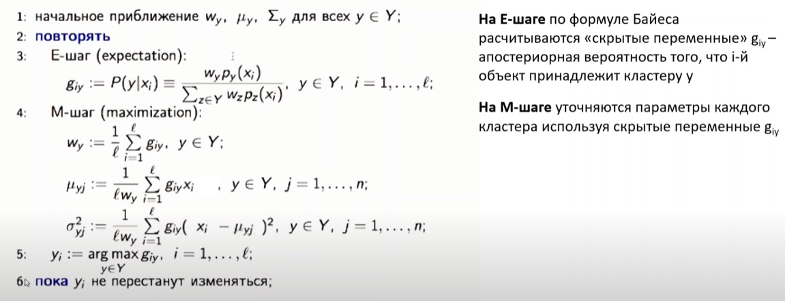

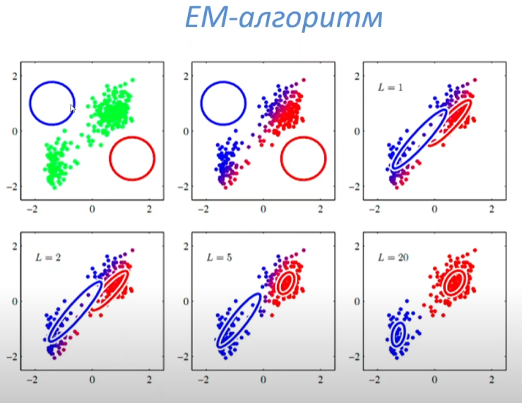

##### Плюсы и минусы  
1. Выбор модели и начальных параметров: 
Важно правильно выбрать модель для кластеризации (например, смесь распределений) и задать адекватные начальные параметры, чтобы избежать застревания в локальных оптимумах.  
2. Число компонентов: 
Количество компонент модели нужно либо задать заранее, либо выбрать с помощью критериев, таких как AIC или BIC. Это особенно важно для смеси распределений, где правильное количество компонент критично для точности модели.  
3. Работа с пропущенными данными: 
EM может эффективно справляться с пропущенными данными, но требует их точной интерпретации на каждом шаге.  
4. Чувствительность к инициализации: 
Алгоритм чувствителен к начальным значениям параметров, поэтому может потребоваться несколько запусков с разными начальной инициализацией для получения стабильных результатов.

---

#### Типы кластерных структур. Формы кластеров.

##### Типы кластерных структур
1. Шаровые кластеры (сферические)  
   Кластеры имеют форму компактных шаров, где объекты внутри каждого кластера равномерно распределены. Это типичный случай для алгоритмов, таких как $k$-средних, которые эффективно работают с такими структурами.

2. Иррегулярные (непрямые) кластеры  
   Кластеры могут иметь сложные формы, такие как кольца или цепочки. Эти структуры могут быть сложными для метода $k$-средних, который предполагает наличие сферических кластеров, но хорошо подходят для методов, таких как DBSCAN, который ищет области высокой плотности.

3. Иерархические кластеры  
   Когда кластеры образуют иерархическую структуру, где один кластер может быть частью другого. Такие структуры хорошо подходят для иерархической кластеризации, которая строит дендрограмму.

4. Гомогенные (однотипные) кластеры  
   Все объекты внутри кластера схожи между собой по всем признакам. Это классическая ситуация, когда объекты из одного кластера имеют минимальное внутреннее различие.

5. Гетерогенные (разнотипные) кластеры  
   Внутри одного кластера могут находиться объекты с различиями, что может быть вызвано неполнотой данных или особенностями самой задачи кластеризации.

##### Формы кластеров
1. Кластеры с компактной формой  
   Эти кластеры представляют собой компактные и сфокусированные области в данных, где объекты имеют небольшие расстояния друг от друга. Такие кластеры хорошо подходят для большинства стандартных методов кластеризации, например, $k$-средних.

2. Кластеры с линейной формой  
   Кластеры могут принимать линейную или вытянутую форму, например, в виде цепочек. Эти структуры сложнее для методов, таких как $k$-средних, но могут быть хорошо найдены с использованием плотностных методов, таких как DBSCAN.

3. Кластеры с кольцевой или кольцевидной формой  
   В некоторых случаях кластеры могут иметь форму колец или обручей. Такие структуры сложно выявить с помощью стандартных алгоритмов кластеризации, но методы плотностной кластеризации (например, DBSCAN) могут быть эффективными.

4. Нестандартные или смешанные формы  
   В реальных данных могут встречаться кластеры с сильно изогнутыми или неоднородными формами. Для таких структур потребуется использование гибких методов кластеризации, таких как алгоритм DBSCAN или спектральная кластеризация, которые могут работать с такими сложными формами.

---

#### Метрики для оценки близости объектов и кластеров. В т.ч. евклидово расстояние, расстояние городских кварталов; метод одиночной связи, метод полной связи, метод Варда.

Метрики расстояния и меры сходства играют ключевую роль в задаче кластеризации, поскольку они определяют, насколько близки или схожи объекты, а также как кластеры будут сливаются или разделяться. Существует несколько типов метрик для оценки близости объектов и кластеров.
##### Метрики для оценки близости объектов

1. Евклидово расстояние  
   Это наиболее часто используемая метрика для числовых данных, измеряющая прямое расстояние между двумя точками в пространстве:
   $$
   d(x, y) = \sqrt{\sum_{i=1}^{n} (x_i - y_i)^2}
   $$
   где $x$ и $y$ — это векторы признаков объектов. Евклидово расстояние работает хорошо, когда данные имеют схожие масштабы и распределение.
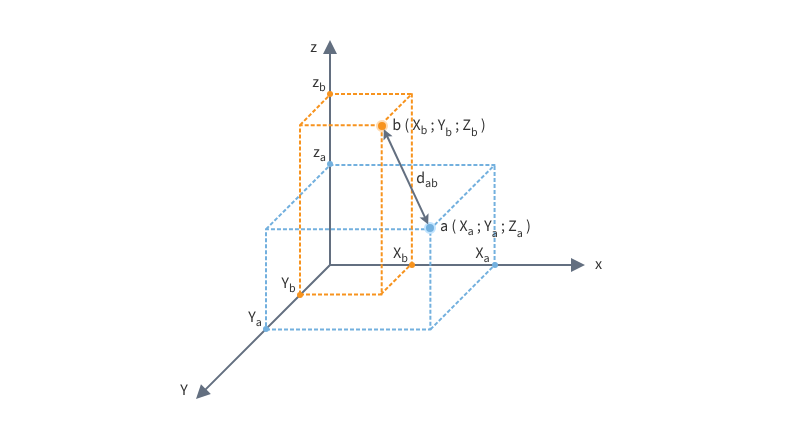
2. Расстояние городских кварталов (Манхэттенское расстояние)  
   Эта метрика вычисляет сумму абсолютных разностей координат:
   $$
   d(x, y) = \sum_{i=1}^{n} |x_i - y_i|
   $$
   Манхэттенское расстояние используется, когда перемещения происходят по сетке, например, при анализе данных в городе, где можно двигаться только по прямым линиям (горизонтально или вертикально).
   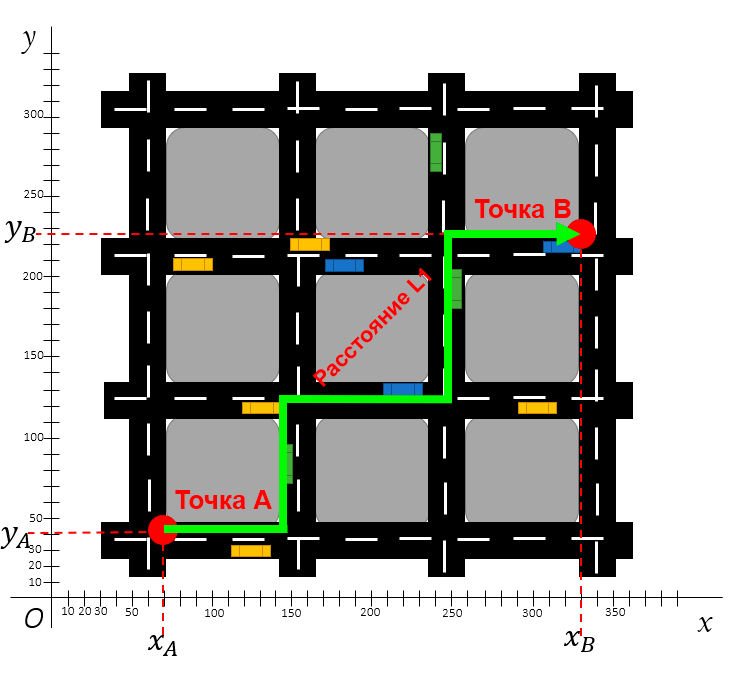

3. Косинусное сходство  
   Используется для измерения сходства между двумя векторами (например, для текстовых данных). Оно определяется как косинус угла между двумя векторами:
   $$
   \text{cosine similarity}(x, y) = \frac{x \cdot y}{\|x\| \|y\|}
   $$
   где $x \cdot y$ — скалярное произведение векторов, а $\|x\|$ и $\|y\|$ — их нормы.
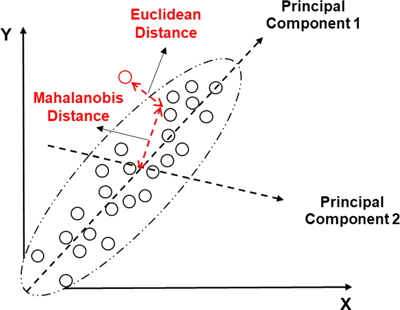
4. Махаланобисово расстояние(метод SHAP)
   Эта метрика учитывает корреляцию между признаками и измеряет расстояние с учётом дисперсии данных:
   $$
   d(x, y) = \sqrt{(x - y)^T S^{-1} (x - y)}
   $$
   где $S$ — ковариационная матрица. Махаланобисово расстояние особенно полезно, когда данные имеют различные масштабы или коррелируют между собой.

##### Метрики для оценки близости кластеров
Метрики для оценки близости кластеров используют расстояния между центроидами кластеров или учитывают все объекты в кластере для вычисления средней дистанции.

1. Метод одиночной связи (Single linkage)  
   В этой метрике расстояние между двумя кластерами определяется как минимальное расстояние между любыми двумя объектами, принадлежащими разным кластерам:
   $$
   d(C_1, C_2) = \min_{x_1 \in C_1, x_2 \in C_2} d(x_1, x_2)
   $$
   Этот метод склонен к образованию длинных, вытянутых кластеров, так как использует минимальное расстояние.

2. Метод полной связи (Complete linkage)  
   В отличие от одиночной связи, метод полной связи измеряет максимальное расстояние между любыми объектами двух кластеров:
   $$
   d(C_1, C_2) = \max_{x_1 \in C_1, x_2 \in C_2} d(x_1, x_2)
   $$
   Этот метод способствует формированию компактных, хорошо разделённых кластеров.

3. Метод Варда (Ward’s method)  
   Метод Варда минимизирует внутрикластерную дисперсию, что означает, что два кластера объединяются, если это приводит к наименьшему увеличению суммы квадратов расстояний внутри кластеров. Это эффективно для кластеров с равной дисперсией:
   $$
   d(C_1, C_2) = \frac{|C_1| |C_2|}{|C_1| + |C_2|} \cdot d(C_1, C_2)
   $$
   Метод Варда является одним из самых популярных в иерархической кластеризации, так как он склонен объединять компактные кластеры.

##### Выбор метрики в зависимости от задачи
1. Евклидово расстояние: 
Подходит для данных с похожими масштабами и распределениями. Эффективно для стандартных числовых данных.
2. Манхэттенское расстояние: 
Хорошо работает, когда перемещения ограничены вертикальными или горизонтальными осями (например, для данных с прямоугольной сеткой).
3. Косинусное сходство: 
Применимо для текстовых данных или когда важна не столько абсолютная величина, сколько направление или угловое сходство.
4. Метод одиночной связи: 
Используется, когда важно объединить самые близкие объекты или кластеры, даже если это приводит к вытянутым структурам.
5. Метод полной связи: 
Подходит для формирования компактных кластеров.
6. Метод Варда: 
Идеален для ситуации, когда кластеры должны быть компактными и равномерно распределёнными по объёмам данных.

---

#### Метрики для оценки качества кластеризации, внутренние и внешние. В т.ч. силуэт, компактность и пр.

При оценке качества кластеризации используются две основные категории метрик:

1. Внутренние метрики — оценивают качество кластеризации на основе самой структуры кластеров без использования внешней информации (например, без информации о том, как объекты должны быть сгруппированы).
2. Внешние метрики — оценивают качество кластеризации с использованием заранее известных меток или истинных классов.

##### Внутренние метрики
1. Силуэт (Silhouette)  
   Силуэт измеряет, насколько хорошо каждый объект вписывается в свой кластер по сравнению с другими кластерами. Он рассчитывается для каждого объекта как разница между средним расстоянием до объектов в своем кластере и средним расстоянием до объектов в ближайшем кластере. Силуэт имеет значение от -1 до 1, где:
   - 1 — объект хорошо кластеризован.
   - 0 — объект находится на границе двух кластеров.
   - -1 — объект вероятно был ошибочно отнесен к неправильному кластеру.

   Формула для силуэта:
   $$
   s(i) = \frac{b(i) - a(i)}{\max(a(i), b(i))}
   $$
   где:
   - $a(i)$ — среднее расстояние между объектом $i$ и всеми другими объектами в его кластере.
   - $b(i)$ — минимальное среднее расстояние между объектом $i$ и объектами всех других кластеров.

2. Компактность  
   Компактность оценивает, насколько объекты внутри одного кластера близки друг к другу. Это может быть измерено через внутрикластерное расстояние, например, среднее или минимальное расстояние между объектами внутри кластера. Меньшее значение компактности указывает на более компактные кластеры.

   Формула для компактности:
   $$
   C = \frac{1}{N} \sum_{i=1}^{N} \sum_{j \in C_i} d(x_i, x_j)
   $$
   где $N$ — количество объектов, $C_i$ — объекты в i-м кластере, а $d(x_i, x_j)$ — расстояние между объектами $x_i$ и $x_j$.

3. Разделимость (Separability)  
   Разделимость оценивает, насколько хорошо различимы кластеры. Это обычно измеряется через среднее расстояние между центроидами разных кластеров. Чем больше среднее расстояние между кластерами, тем выше их разделимость.

   Формула для разделимости:
   $$
   D = \frac{1}{K(K-1)} \sum_{i \neq j} \frac{d(C_i, C_j)}{d(C_i, C_j) + \epsilon}
   $$
   где $C_i$ и $C_j$ — центроиды разных кластеров, а $\epsilon$ — небольшая константа, чтобы избежать деления на ноль.

4. Индекс Давидсона-Харкса (Davies-Bouldin Index)  
   Этот индекс измеряет среднее расстояние между центрами кластеров относительно внутрикластерной компактности. Меньшие значения этого индекса указывают на лучшее качество кластеризации.

   Формула для индекса Давидсона-Харкса:
   $$
   DB = \frac{1}{K} \sum_{i=1}^{K} \max_{i \neq j} \left( \frac{S_i + S_j}{d(C_i, C_j)} \right)
   $$
   где $S_i$ и $S_j$ — внутрикластерные расстояния для кластеров $C_i$ и $C_j$, а $d(C_i, C_j)$ — расстояние между центроидами кластеров.

##### Внешние метрики
1. Индекс Рэнд (Rand Index)  
   Индекс Рэнд измеряет согласованность между двумя кластеризациями (например, между настоящими метками классов и результатами кластеризации). Он имеет значения от 0 до 1, где 1 означает полное совпадение кластеризаций, а 0 — полное несоответствие.

   Формула для индекса Рэнд:
   $$
   RI = \frac{a + d}{a + b + c + d}
   $$
   где:
   - $a$ — количество пар объектов, которые правильно отнесены к одному кластеру в обеих кластеризациях.
   - $b$ — количество пар объектов, которые неправильно отнесены к одному кластеру.
   - $c$ — количество пар объектов, которые неправильно отнесены к разным кластерам.
   - $d$ — количество пар объектов, которые правильно отнесены к разным кластерам.

    Пример: 
    У нас есть две кластеризации для набора из 5 объектов. Первая кластеризация разделяет объекты на два кластера, а вторая — на три.

    - Кластеризация 1 (истинные метки):  
    Кластер 1: {1, 2, 3}  
    Кластер 2: {4, 5}

    - Кластеризация 2 (предсказанные метки):  
    Кластер 1: {1, 2}  
    Кластер 2: {3, 4}  
    Кластер 3: {5}

    Шаги для вычисления индекса Ранда:

    1. Находим количество пар объектов:
    - Сначала находим все возможные пары объектов. У нас 5 объектов, так что всего $C(5, 2) = 10$ пар.
    
    2. Оцениваем, правильно ли мы отнесли пары объектов в одну или другую группу:
    - Пары, которые были правильно кластеризованы (правильно отнесены к одному или разным кластерам), считаются положительными или отрицательными результатами.
    
    Например:
    - Пара (1, 2) в первой кластеризации была в одном кластере, и во второй кластеризации также в одном кластере.
    - Пара (3, 4) в первой кластеризации была в разных кластерах, и во второй кластеризации также в разных кластерах.

    3. Подсчитываем количество правильных пар $a$ и неправильных $b$, $c$:
    -$a$ — количество пар, которые правильно отнесены в одно и то же множество (один кластер).
    -$d$ — количество пар, которые правильно отнесены к разным кластерам.

    4. Подставляем в формулу:
    $$
    RI = \frac{a + d}{a + b + c + d}
    $$
    где$a, b, c, d$ — количество правильных и неправильных пар.

    Результат:
    Индекс Ранда для данного примера будет определяться на основе этих подсчётов. Если результат близок к 1, то кластеризация совпадает с истинными метками.

2. Нормализованный взаимный индекс (Normalized Mutual Information, NMI)  
   NMI оценивает, насколько хорошо кластеризация соответствует истинным меткам, измеряя взаимную информацию между кластеризацией и истинными метками классов. Значение варьируется от 0 до 1, где 1 означает полное соответствие.

   Формула для NMI:
   $$
   NMI = \frac{I(X, Y)}{\sqrt{H(X) H(Y)}}
   $$
   где $I(X, Y)$ — взаимная информация между истинными метками $X$ и результатами кластеризации $Y$, а $H(X)$ и $H(Y)$ — энтропия распределений $X$ и $Y$.

   Пример: Пусть у нас есть два набора данных, и мы хотим вычислить взаимную информацию между их кластеризациями.

    - Кластеризация 1 (истинные метки):  
    Кластер 1: {1, 2, 3}  
    Кластер 2: {4, 5}

    - Кластеризация 2 (предсказанные метки):  
    Кластер 1: {1, 2}  
    Кластер 2: {3, 4}  
    Кластер 3: {5}

    Шаги для вычисления NMI:

    1. Вычисляем взаимную информацию$I(X, Y)$, которая измеряет, сколько информации между двумя переменными (кластеризациями) перекрывается.

    2. Затем вычисляем энтропию для обеих кластеризаций$H(X)$ и$H(Y)$, которые измеряют неопределенность в распределениях истинных и предсказанных меток.

    3. Подставляем в формулу для NMI:
    $$
    NMI = \frac{I(X, Y)}{\sqrt{H(X) H(Y)}}
    $$
    где $I(X, Y)$ — взаимная информация, а $H(X)$ и $H(Y)$ — энтропии.

    Результат:
    NMI будет равен 1, если кластеризации полностью совпадают, и 0, если нет никакой взаимной информации между кластеризациями.

3. Коэффициент Джаккарда (Jaccard Index)  
   Этот индекс измеряет схожесть между двумя наборами данных. Он определяется как отношение количества общих элементов к количеству всех элементов в двух наборах. В контексте кластеризации Джаккард измеряет схожесть между истинными метками и предсказанными кластерами.

   Формула для коэффициента Джаккарда:
   $$
   J(A, B) = \frac{|A \cap B|}{|A \cup B|}
   $$
   где $A$ и $B$ — это два набора объектов (например, объекты, принадлежащие одному кластеру).

   Пример: Рассмотрим два набора объектов, и нам нужно оценить схожесть между ними с помощью коэффициента Джаккарда.

    - Набор A: {1, 2, 3, 4}  
    - Набор B: {3, 4, 5, 6}

    Шаги для вычисления коэффициента Джаккарда:

    1. Находим пересечение и объединение двух наборов:
    - Пересечение$A \cap B = {3, 4}$
    - Объединение$A \cup B = {1, 2, 3, 4, 5, 6}$

    2. Рассчитываем коэффициент Джаккарда как отношение размера пересечения и размера объединения:
    $$
    J(A, B) = \frac{|A \cap B|}{|A \cup B|} = \frac{2}{6} = 0.33
    $$

    Результат:
    Коэффициент Джаккарда для этих наборов равен 0.33, что означает, что их схожесть составляет 33%.

##### How to выбрать метрику
1. Для внутренних метрик:
   - Силуэт: Хорошо для оценки общей однородности кластеров и разделимости.
   - Компактность: Подходит для проверки сжимаемости кластеров и внутреннего качества.
   - Разделимость: Полезна для оценки, насколько хорошо кластеры разделены друг от друга.

2. Для внешних метрик:
   - Индекс Рэнд: Хорош для сравнения кластеризаций с истинными метками.
   - NMI: Эффективен, если есть известные метки классов, и нужна оценка согласованности с этими метками.
   - Коэффициент Джаккарда: Применим для оценки схожести между двумя разными кластеризациями или при сравнении результатов с метками.

Каждая из этих метрик может быть полезна в зависимости от конкретной задачи кластеризации и целей, которые ставятся перед анализом.

---

#### Для представленной структуры (диаграмма рассеивания) обосновать выбор метода кластеризации.
Диаграмма рассеивания (или scatter plot) — это график, который используется для визуализации связи между двумя переменными. На такой диаграмме каждый объект данных представлен точкой, расположенной в координатной системе. Ось X и ось Y на диаграмме отображают значения двух переменных (признаков), а положение точек на этих осях показывает их значения.
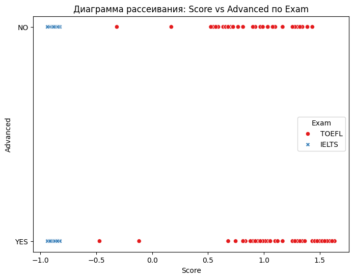

Для обоснования выбора метода кластеризации в зависимости от представленной структуры данных (диаграммы рассеивания), нужно учитывать несколько ключевых факторов, таких как форма кластеров, распределение данных и цели кластеризации. Вот как можно подходить к выбору метода, опираясь на тип структуры данных:

##### 1. Сферические или округлые кластеры
Если на диаграмме рассеивания наблюдаются чётко разделённые круглые или сферические кластеры (где объекты в одном кластере близки друг к другу, а кластеры не перекрываются), можно использовать метод k-средних. Этот метод идеально подходит для таких случаев, так как предполагает, что кластеры имеют форму, близкую к шарам, и использует центроиды для разделения данных.

- Выбор метода: Метод k-средних
- Почему: Он минимизирует внутрикластерную дисперсию и хорошо работает, когда кластеры имеют одинаковую форму (сферическую).
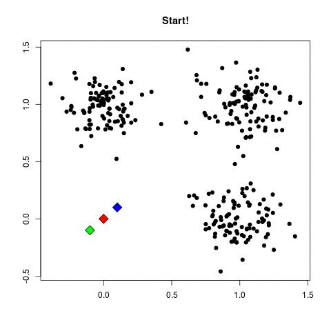

##### 2. Неоднородные или вытянутые кластеры
Если кластеры имеют более сложную, вытянутую или эллиптическую форму, то метод DBSCAN может быть лучшим выбором. Этот метод кластеризации на основе плотности не требует заранее заданного числа кластеров и может эффективно работать с кластерами, которые имеют нерегулярную форму и переменную плотность.

- Выбор метода: Метод DBSCAN
- Почему: DBSCAN позволяет обнаруживать кластеры произвольной формы и хорошо справляется с шумом (выбросами) и переменной плотностью, что делает его подходящим для сложных структур.
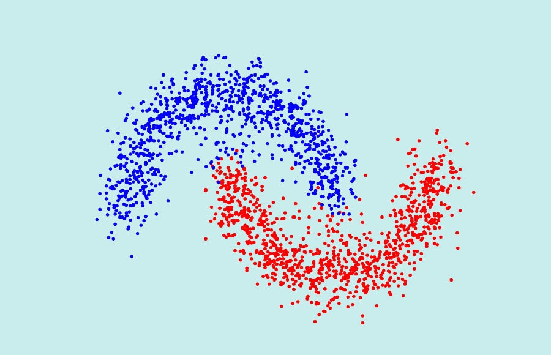

##### 3. Кластеры с иерархической структурой
Если кластеры не явно разделены на отдельные группы, но имеют иерархическую структуру (например, один кластер может быть вложен в другой), то стоит использовать иерархические методы кластеризации. Эти методы, как агломеративная или дивизивная кластеризация, строят дендрограмму, которая позволяет понять, как данные могут быть сгруппированы на разных уровнях.

- Выбор метода: Иерархическая кластеризация
- Почему: Этот метод помогает обнаружить иерархические отношения между объектами и позволяет настроить количество кластеров после анализа дендрограммы.
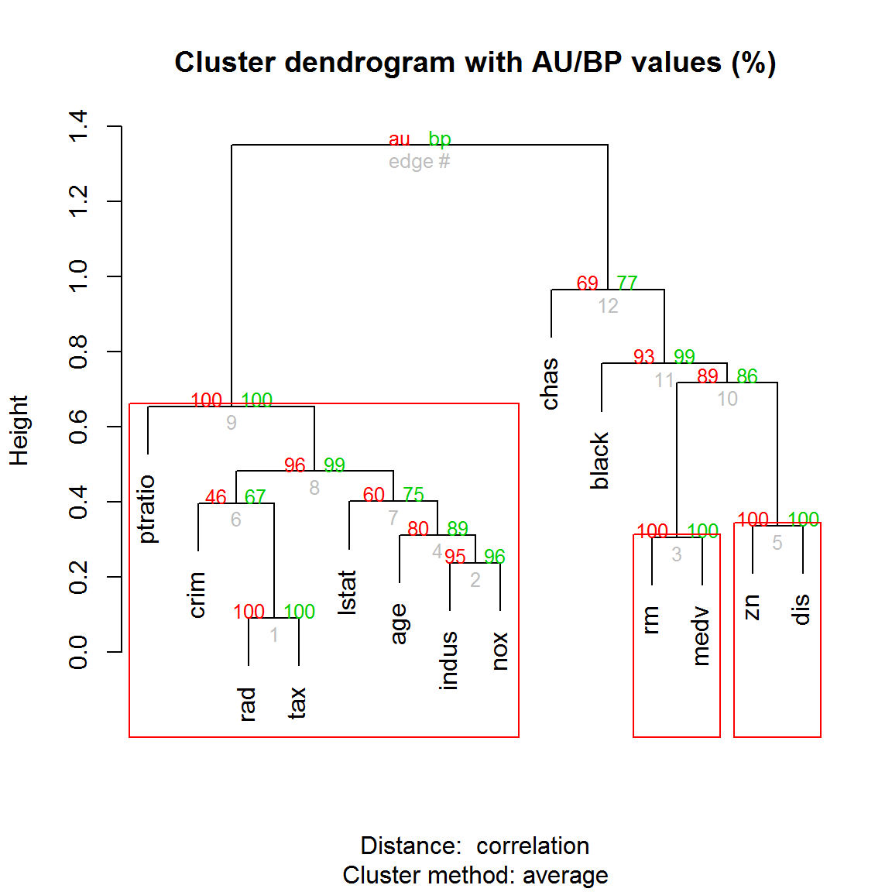

##### 4. Смешанные кластеры с переменной плотностью
Если на диаграмме рассеивания видно, что данные состоят из кластеров с разной плотностью (например, один кластер более плотный, а другой — менее), то лучший выбор — это метод DBSCAN. Он позволяет кластеризовать объекты на основе плотности, эффективно находя кластеры с различной плотностью и идентифицируя выбросы.

- Выбор метода: Метод DBSCAN
- Почему: DBSCAN хорошо справляется с кластерами переменной плотности и шумом, что делает его подходящим для таких случаев.
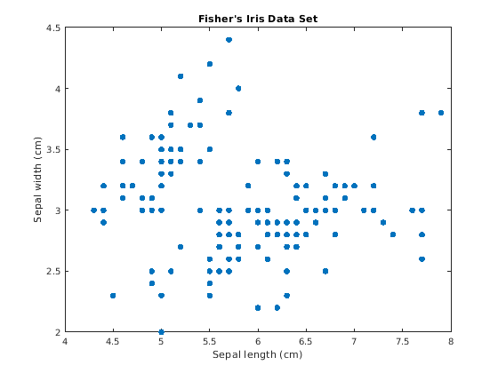

##### 5. Неявно разделённые кластеры
Если кластеры на диаграмме не имеют чётких границ или между ними есть «переходные зоны», то для обнаружения таких кластеров может подойти метод EM (Expectation-Maximization), который предполагает вероятностную модель кластеризации. Этот метод позволяет разделить данные, даже если границы между кластерами неочевидны, и оценить вероятность принадлежности каждого объекта к каждому кластеру.

- Выбор метода: Метод EM
- Почему: EM подходит для случаев, когда данные имеют скрытую структуру и кластеризация должна учитывать вероятностную природу распределений данных.
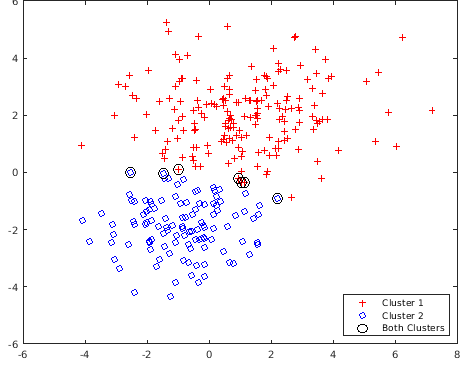

##### 6. Кластеры, разделённые границами
Если данные на диаграмме рассеивания можно разделить прямыми линиями или другими гиперплоскостями (например, при наличии чётких границ между кластерами), то для кластеризации подойдёт метод k-средних или спектральная кластеризация, если данные могут быть линейно разделимы в преобразованном пространстве.

- Выбор метода: Метод k-средних или спектральная кластеризация
- Почему: Спектральная кластеризация может эффективно разделять данные с нестандартными границами, а k-средних работает хорошо для данных с чёткими линейными границами.
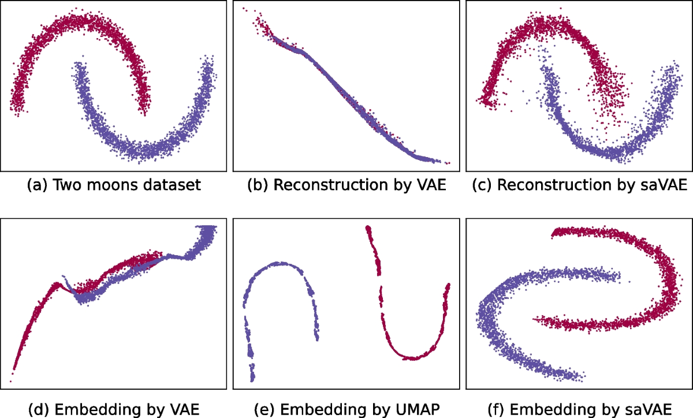

##### Резюме

- k-средних: Подходит для сферических и чётко разделённых кластеров.
- DBSCAN: Подходит для кластеров с переменной плотностью и произвольной формой.
- Иерархическая кластеризация: Полезна для данных с иерархической структурой.
- EM: Подходит для данных с неявными или сложными границами кластеров.
- Спектральная кластеризация: Подходит для данных, которые требуют преобразования пространства для чёткого разделения.

---

#### По графику (диаграмма рассеивания с обозначением принадлежности объектов кластерам) оценить эффективность метода.

Оценка эффективности метода кластеризации по графику (диаграмме рассеивания с обозначением принадлежности объектов кластерам) включает несколько ключевых аспектов, которые можно визуализировать на графике. Вот шаги и основные критерии для этой оценки:

##### 1. Чёткость разделения кластеров
   - Что проверять: 
   На графике объекты должны быть разделены на чёткие группы (кластеры), и между ними должны быть заметные «пустые» зоны, указывающие на различия между кластерами.
   - Что говорить о хорошем результате: 
   Если кластеры чётко разделены и объекты внутри каждого кластера расположены плотно друг к другу, это говорит о высоком качестве кластеризации.
   - Что говорить о плохом результате: 
   Если кластеры сильно пересекаются или объекты расположены случайным образом, это может свидетельствовать о том, что метод неэффективен для данной структуры данных.

##### 2. Гомогенность внутри кластеров
   - Что проверять: 
   Объекты внутри каждого кластера должны быть достаточно похожи друг на друга по признакам (например, по расстояниям между точками в кластере).
   - Что говорить о хорошем результате: 
   Точки внутри каждого кластера расположены близко друг к другу.
   - Что говорить о плохом результате: 
   Если объекты внутри кластера разбросаны на больших расстояниях, это может указывать на низкое качество кластеризации.

##### 3. Симметрия кластеров
   - Что проверять: Кластеры должны иметь симметричную и логичную форму, особенно если метод предполагает сферические или овальные формы (например, метод k-средних).
   - Что говорить о хорошем результате: Кластеры выглядят симметричными и однородными.
   - Что говорить о плохом результате: Если кластеры выглядят странно или имеют аномальные формы, возможно, метод не подошёл для этих данных (например, в случае применения k-средних к данным с нерегулярными формами).

##### 4. Выбросы
   - Что проверять: 
   На графике следует выявить, есть ли точки, которые явно выбиваются из общих кластеров. Выбросы могут быть помечены другим цветом или символом.
   - Что говорить о хорошем результате: 
   Если выбросы не образуют собственных кластеров, это обычно говорит о хорошем качестве кластеризации (метод DBSCAN, например, может эффективно выявлять выбросы).
   - Что говорить о плохом результате: 
   Если выбросы сгруппированы в кластеры, это может свидетельствовать о неэффективности алгоритма.

##### 5. Соотношение количества кластеров и реальной структуры данных
   - Что проверять: 
   Проверить, соответствует ли количество кластеров, определённых методом, количеству «естественных» кластеров, которые можно наблюдать на графике.
   - Что говорить о хорошем результате: 
   Если количество кластеров логично, и они хорошо отражают структуру данных, значит метод был правильно выбран.
   - Что говорить о плохом результате: 
   Если число кластеров слишком велико или слишком мало по сравнению с наблюдаемой структурой данных, это может свидетельствовать о плохой настройке параметров или неправильном выборе метода кластеризации.

##### 6. Сравнение с истинными метками (если они известны)
   - Что проверять: 
   Если у вас есть истинные метки классов (например, для задачи с контролируемым обучением), можно проверить, насколько хорошо метод кластеризации соответствует этим меткам.
   - Что говорить о хорошем результате: 
   Если кластеры на графике соответствуют истинным меткам, это является индикатором высокой эффективности кластеризации.
   - Что говорить о плохом результате: 
   Если кластеры сильно отличаются от истинных меток, это может говорить о недостаточной точности метода.

#### Резюме:
Для оценки эффективности метода кластеризации по диаграмме рассеивания важно обращать внимание на чёткость разделения кластеров, гомогенность объектов внутри кластеров, форму кластеров, наличие выбросов и соотношение количества кластеров с реальной структурой данных.

---

#### Рекомендации по выбору значений параметров для изучаемых методов кластеризации. Достоинства и недостатки методов.
Каждый метод кластеризации имеет свои параметры, которые необходимо правильно настроить для получения наилучших результатов. Вот рекомендации по выбору значений параметров для основных методов кластеризации:

##### 1. Метод k-средних

###### Параметры:
- k (количество кластеров): 
  - Этот параметр нужно задать заранее, и выбор значения k является ключевым.
  - Рекомендации: 
    - Можно использовать метод локтя (elbow method), чтобы найти оптимальное значение k. Он основан на построении графика зависимости суммы квадратов ошибок (SSE) от числа кластеров.
    - Также можно применить метод силуэта для оценки качества кластеризации для различных значений k.
    - В случае сложных структур с неизвестным количеством кластеров можно попробовать использовать другие методы (например, DBSCAN).

- Инициализация центроидов: 
  - Метод инициализации влияет на качество кластеризации. Часто используется метод случайной инициализации, но существует более улучшенный алгоритм — k-средних++, который помогает выбрать начальные центроиды более эффективно.
  
- Метрика расстояния: 
  - Обычно используется евклидово расстояние, но если данные имеют разные масштабы или неконтролируемые выбросы, можно рассмотреть другие метрики или предварительно нормализовать данные.

###### Достоинства:
- Простота и эффективность для сферических кластеров.
- Быстро работает для большого количества данных.

###### Недостатки:
- Требует заранее заданного числа кластеров (k).
- Чувствителен к выбросам.
- Не работает с сложными или сильно перекрывающимися кластерами.

##### 2. Метод DBSCAN

###### Параметры:
- ε (эпсилон): Радиус окрестности для определения плотности.
  - Рекомендации: 
    - Меньшее значение ε приведет к большему числу кластеров, а большее значение — к меньшему числу кластеров.
    - Можно использовать график расстояний до ближайших соседей (k-distance plot), чтобы выбрать оптимальное значение ε.
  
- minPts (минимальное количество точек): Минимальное количество точек, которые требуется для формирования кластера.
  - Рекомендации: 
    - Обычно значение minPts устанавливается в 4 или больше.
    - Для данных с высокой плотностью выбирайте небольшие значения, для менее плотных данных — больше.

###### Достоинства:
- Не требует задания числа кластеров.
- Хорошо работает с произвольной формой кластеров.
- Может обнаруживать выбросы (шум).

###### Недостатки:
- Чувствителен к выбору параметров ε и minPts.
- Неэффективен для кластеров с переменной плотностью.
- Сложности при работе с высокоразмерными данными.

##### 3. Иерархическая кластеризация

###### Параметры:
- Метод объединения или деления: Для агломеративной кластеризации можно выбирать между методами одиночной связи, полной связи, метода Варда, и др.
  - Рекомендации: 
    - Метод Варда минимизирует внутрикластерную дисперсию и является хорошим выбором для большинства случаев.
    - Метод одиночной связи может быть полезен, если кластеры имеют вытянутую форму.
    - Метод полной связи подходит для более компактных кластеров.

- Количество кластеров: Кластеры выбираются после построения дендрограммы.
  - Рекомендации: 
    - Используйте дендрограмму для определения оптимального числа кластеров, разрезая её на соответствующей высоте.

###### Достоинства:
- Не требует заранее заданного числа кластеров.
- Хорошо работает для иерархических структур.
- Обеспечивает полное дерево кластеризации (дендрограмму), что позволяет детально анализировать результаты.

###### Недостатки:
- Неэффективен для больших наборов данных (время работы O(n²)).
- Может быть чувствителен к шуму и выбросам.

##### 4. Метод EM (Expectation-Maximization)

###### Параметры:
- Число компонентов (кластеров): Метод EM требует задания числа кластеров, как и метод k-средних.
  - Рекомендации: 
    - Используйте критерий информационного критерия Акаике (AIC) или байесовский информационный критерий (BIC), чтобы выбрать оптимальное количество кластеров.
  
- Инициализация параметров: Требуется инициализация начальных параметров для моделей распределений.
  - Рекомендации: 
    - Используйте метод k-средних или случайную инициализацию для выбора начальных центроидов и вариаций распределений.
  
- Тип распределения: EM работает с нормальными распределениями, но можно модифицировать модель для работы с другими типами распределений (например, для бинарных данных или распределений с другой плотностью).

###### Достоинства:
- Хорошо работает с данными, где кластеры имеют вероятностную природу.
- Может использоваться для сложных распределений, например, гауссовых смесей.

###### Недостатки:
- Чувствителен к начальной инициализации.
- Может привести к переобучению (overfitting).
- Требует предположений о форме распределений.

##### 5. Спектральная кластеризация

###### Параметры:
- Количество кластеров (k): Количество кластеров задаётся заранее.
  - Рекомендации: 
    - Используйте метод локтя или силуэт для выбора k.
  
- Метрика расстояния: Обычно используется графовое расстояние между точками, но можно выбирать и другие метрики в зависимости от структуры данных.

###### Достоинства:
- Подходит для данных с нелинейными границами между кластерами.
- Может эффективно работать с графовыми данными или данными с произвольной формой кластеров.

###### Недостатки:
- Сложность в вычислениях (необходима операция сингулярного разложения матрицы).
- Могут возникать проблемы с масштабируемостью при большом объёме данных.

##### Общие рекомендации по выбору метода:
- Для сферических кластеров используйте метод k-средних.
- Для кластеров с произвольной формой и переменной плотностью лучше использовать DBSCAN.
- Для кластеров с иерархической структурой выберите иерархическую кластеризацию.
- Для сложных, вероятностных структур используйте метод EM.
- Для сложных границ и нелинейных данных применяйте спектральную кластеризацию.